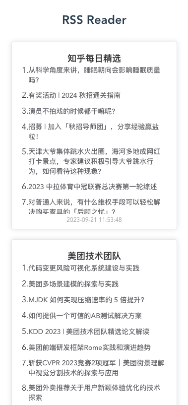

# 简述

实时展示rss订阅最新消息。

## 特性

- 打包后镜像大小仅有约20MB，通过docker实现一键部署

- 支持自定义配置页面数据自动刷新

- 响应式布局，能够兼容不同的屏幕大小

- 良好的SEO，首次加载使用模版引擎快速展示页面内容

- 支持添加多个RSS订阅链接

- 简洁的页面布局，可以查看每个订阅链接最后更新时间

2023年7月28日，进行了界面改版和升级




# 配置文件

配置文件位于config.json，sources是RSS订阅链接，示例如下

```json
{
    "values": [
        "https://www.zhihu.com/rss",
        "https://tech.meituan.com/feed/",
        "http://www.ruanyifeng.com/blog/atom.xml",
        "https://feeds.appinn.com/appinns/",
        "https://v2ex.com/feed/tab/tech.xml",
        "https://www.cmooc.com/feed",
        "http://www.sciencenet.cn/xml/blog.aspx?di=30",
        "https://www.douban.com/feed/review/book",
        "https://www.douban.com/feed/review/movie",
        "https://www.geekpark.net/rss",
        "https://hostloc.com/forum.php?mod=rss&fid=45&auth=389ec3vtQanmEuRoghE%2FpZPWnYCPmvwWgSa7RsfjbQ%2BJpA%2F6y6eHAx%2FKqtmPOg"
    ],
    "refresh": 6,
    "autoUpdatePush": 7
}
```

名称 | 说明
-|-
values | rss订阅链接（必填）
refresh | rss订阅更新时间间隔，单位分钟（必填）
autoUpdatePush | 自动刷新间隔，默认为0，不开启。效果为前端每autoUpdatePush分钟自动更新页面信息，单位分钟（非必填）

# 使用方式

## Docker部署

环境要求：Git、Docker、Docker-Compose

克隆项目

```bash
git clone https://github.com/srcrs/rss-reader
```

进入rss-reader文件夹，运行项目

```bash
docker-compose up -d
```

国内服务器将Dockerfile中取消下面注释使用 go mod 镜像
```dockerfile
#RUN go env -w GO111MODULE=on && \
#    go env -w GOPROXY=https://goproxy.cn,direct
```

部署成功后，通过ip+端口号访问

# nginx反代

这里需要注意/ws，若不设置proxy_read_timeout参数，则默认1分钟断开。静态文件增加gzip可以大幅压缩网络传输数据

```conf
server {
    listen 443 ssl;
    server_name rss.lass.cc;
    ssl_certificate  fullchain.cer;
    ssl_certificate_key lass.cc.key;
    gzip on;
    gzip_types text/plain text/css application/json application/javascript text/xml application/xml application/xml+rss text/javascript;
    location / {
        proxy_pass  http://localhost:8080;
    }
    location /ws {
        proxy_pass http://localhost:8080/ws;
        proxy_http_version 1.1;
        proxy_set_header Upgrade $http_upgrade;
        proxy_set_header Connection "Upgrade";
        proxy_set_header Host $host;
        proxy_read_timeout 300s;
    }
}

server {
    listen 80;
    server_name rss.lass.cc;
    rewrite ^(.*)$ https://$host$1 permanent;
}
```
